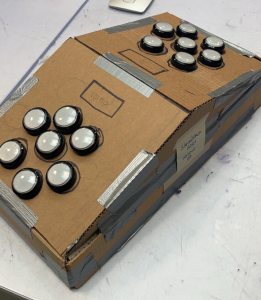
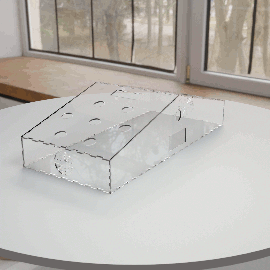
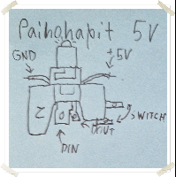
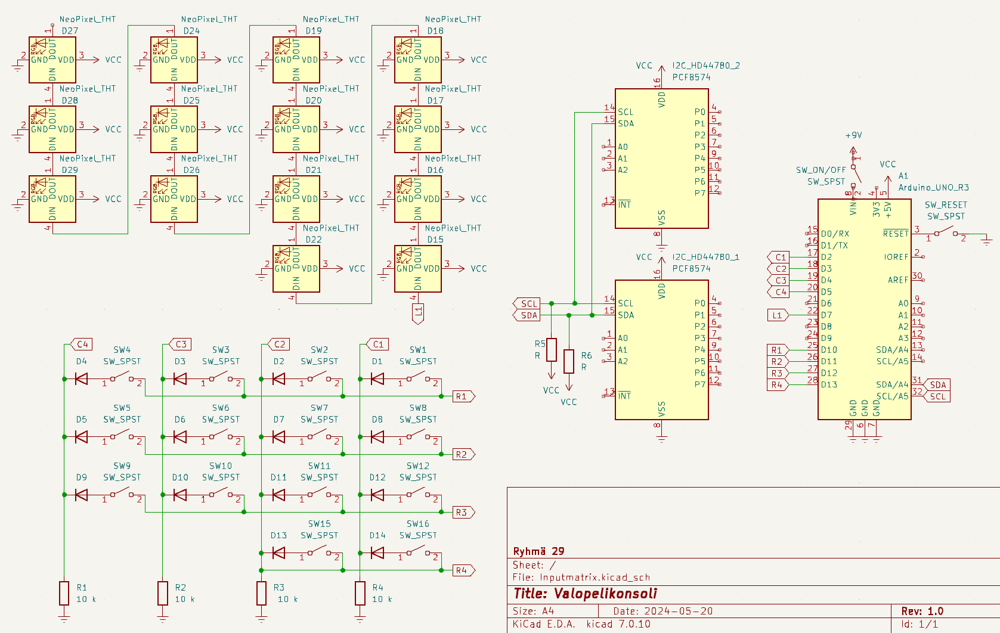
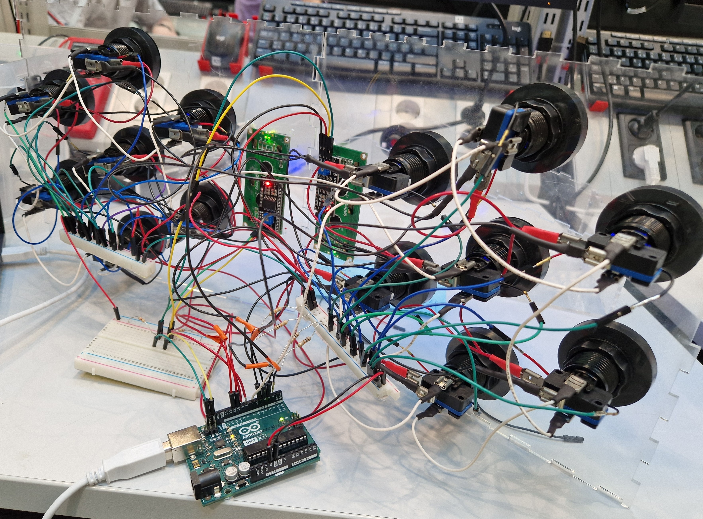

# Valopelikonsoli

Valopelikonsoli ("Light game console") is an Arduino-based simple 2-player game console created as part of an electrical workshop project course at Aalto University in Spring 2024. It uses a keypad matrix to handle the switches with fewer pins.

Created with PlatformIO + Arduino lib using C++ and the following libraries (defined in [platformio.ini](./platformio.ini)):
- duinowitchery/hd44780@^1.3.2
- fastled/FastLED@^3.6.0

Implemented games:
- Whack-a-mole, where the aim is to be the first to hit the yellow light which lights up on both sides, while avoiding red lights.
- Memory game, where a random pattern keeps increasing by one every time the player gets it correct (asynchronous for players)
- Speed game, where lights appear in random places and the player must press as many as possible in the time limit (asynchronous for players)

## BOM / parts

| Part | Quantity | Note |
| --- | --- | --- |
| PCF8574 I2C backpack/HD44780 16x2 LCD module |	2	| I2C-based screens, 1 per player |
| 10 K resistor |	4	| Pulldown for the columns of the matrix |
| 4.8 K resistor |	2 |	I2C pull-up |
| DT44L12-W arcade buttons with switches	| 15 | 7 buttons per player + reset |
| NeoPixel ARGB LED |	14 |	Addressable LEDs to place inside buttons |
| IN4148 Diodi |	14	| Blocking reversed current in matrix |
| Arduino UNO R3 | 1	| Microcontroller, Mini also has enough pins |
| 9V -battery	| 1	| Power source for Arduino/LEDs |
| 9V battery holder with DC5521 -jack |	1 |	Power switch and connector to Arduino |
| Dupont-connector cables	| A lot |	Male-male & male-female |

## Implementation

### Displays

The original idea was to use OLED displays for both color and higher resolution, but the workshop could not find any displays of suitable size and the basic 64x128 monochrome SSD1306 would require a 64*128=8192-bit (1024 bytes) buffer, so two displays would fill the Arduino UNO's 2048 byte SRAM. In the implementation, we therefore ended up using regular 2x16 seven-segment LCD displays, but with I2C backpacks instead of SPI to save on the Arduino's pin count. The workshop's I2C-LCD displays (including the 1602 LCD module) utilize Hitachi's HD44780 LCD controller with Texas Instruments' PCF8574 I2C I/O expansion chip. We found an easy-to-use HD44780.h library for this combination, which has a separate hd44780_I2Cexp subclass for controlling the I2C backpack.

To control two I2C displays, you must ensure that the displays have different I2C addresses. In the case of LCD modules, the address change is done by soldering two marked areas on the circuit board together. In the actual connection, the SDA/SCL connections of the displays are connected in parallel, but I2C pull-up resistors are needed before the corresponding connections on the Arduino.

We attached the screens to the console frame by drilling two holes in the console on each player's side. This allowed us to attach the screens with a string.

### Frame

Cardboard prototype

3D model in Blender with reduced size compared to prototype. Was laser cut according to the modeled object ([SVG file](assets/laser_cutting.svg))

### Buttons

[A holder suitable for DT44L12-W buttons that can accommodate four connections for an ARGB LED](assets/LED_holder_2.stl) (STL file)

The workshop didn't have ready-made Arcade-style pushbuttons with ARGB LEDs and ready-made solutions were expensive, so we implemented them ourselves with DT44L12-W buttons. For the buttons, a four-pin holder was created for the LEDs, two of which (DIN and DOUT) work with the button connections and the power is provided by new wires coming out of the buttons.

The LED was attached to the printed holder so that the connections did not touch each other and the outermost connections (DIN, DOUT) were connected to the existing connections of the buttons. The new connections required two gaps between the switch and the holder, which were ground with a small file on each switch holder. The new connections were soldered with wires, which were still insulated in the printed holder with electrical tape, in order to avoid mixing of the signals of the connections.

The functionality of the button LEDs was verified by testing both a single button and a series connection, where the DOUT of one button continues to the DIN connector of the other button. It is important to note in the project that not all ARGB LEDs are of the same type, which was reflected in the fact that some of the LEDs initialized blue when started, while some remained off. At the same time, the series connection of the LEDs did not work with every order of buttons, but a working series had to be manually tested. No reasonable explanation has been found for this, as the order did not depend on the types of LEDs. In the broken series, the LEDs started flashing randomly and did not follow the value given in the code.

### Key matrix

The Arduino UNO has 14 digital I/O connections, which would not be enough for this project if each component was connected separately, which is why the LEDs have been connected in series. Despite this, the Arduino still would not have enough connections if each switch were separate. For this reason, the console utilizes a keypad matrix adapted from computer keyboards, where several switches are connected to rows and columns and the controller repeatedly scans one row at a time if a button in the column is active (state HIGH).

For the matrix, the wiring had to be created according to the wiring diagram with connectors, where 3-4 switches were in a row in parallel and 2-4 in a column in parallel. In the case of columns, diodes were used in series with the switch to avoid ghost presses, as otherwise current could flow to other rows when several switches were pressed.

### Wiring

(The PCF8574 components are part of the I2C/LCD modules, meaning that connections other than VCC/VSS/SCL/SDA are part of the module and not marked in the diagram.)

### Program

Found in [src/menu.cpp](src/menu.cpp) and [src/patterns.h](src/patterns.h)

## Conclusions from the project

The project was quite successful overall and all participants learned a lot. One clear area for improvement would be wiring, as the use of breadboards and Dupont wires led to situations where a single wire would come loose from inside the console, causing hard-to-trace operational problems that took time to resolve.
On the other hand, in terms of sustainability, using detachable wires meant easy disassembly and possibility of reuse.

Otherwise, the console is a fairly complete package and any further development would likely involve creating new games or converting the code to a more readable format,
as it currently contains somewhat confusing structures. Many functions should also be separated into their own functions and class structures, and refactored to utilize shared structures.
The existing format is a remnant of both experimenting with the hardware and people working independently without much coordination.